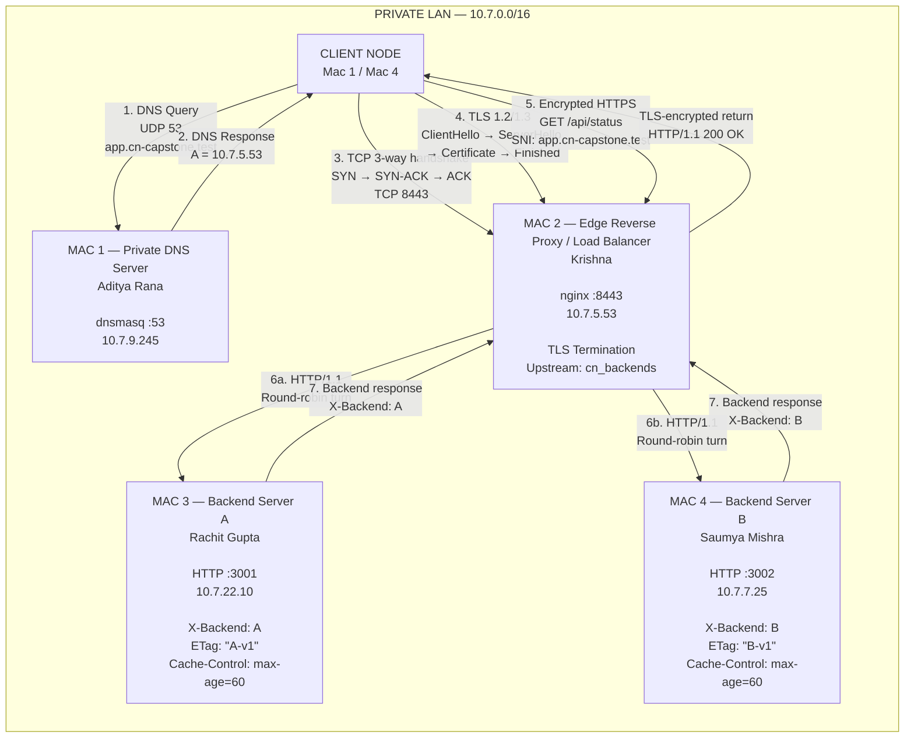
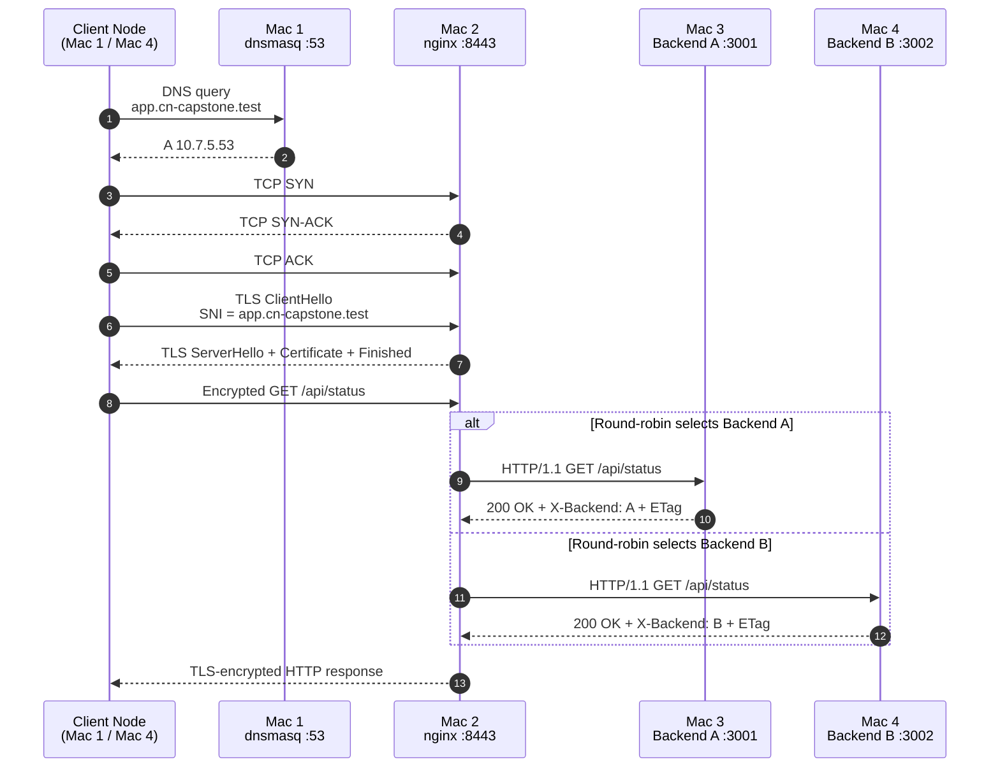

# Private Network Service Platform

> **README source note:** This README is a Mermaid-formatted version of the supplied project markdown. The technical values and terminology are preserved from that source; for final submission, cross-check the network inventory and evidence filenames against the latest team evidence PDFs.
## Computer Networks Course Project — Phase 1: Build & Observe

### Core Principle
> *"The application stays simple; the network is the project."*

---

## 1. Project Purpose & Overview

This project implements a fully functional private network service platform deployed across physical macOS workstations connected to an isolated local area network (LAN). Designed and built entirely from scratch without external cloud providers, pre-configured servers, or public domain registrars, the platform demonstrates and proves the complete lifecycle of a client network request.

A client machine on the team's private network:
1. Accesses the service using a private domain name (`app.cn-capstone.test`).
2. Resolves that domain through the team's own authoritative DNS server running `dnsmasq`.
3. Establishes a secure Transport Layer Security (TLS 1.2 / 1.3) connection to an edge reverse proxy running `nginx`.
4. Receives HTTP/REST responses distributed across two backend application server instances via round-robin load balancing.
5. Observes and verifies every protocol transition across the stack (DNS, TCP, TLS, HTTP) using tools including `curl`, `dig`, `openssl`, and `Wireshark`.

---

## 2. Team Organization & Machine Roles

The platform distributes network responsibilities across distinct physical macOS laptops. Each machine assumes a defined network role mapping directly to modern enterprise and cloud architectural equivalents:

| Machine | Team Member | Primary Network Role | Services Running | Network Endpoints & Ports | Cloud Infrastructure Equivalent |
|:---|:---|:---|:---|:---|:---|
| **Mac 1** | **Aditya Rana** | Private DNS Server + Test Client | `dnsmasq`, `dig`, `nslookup`, `curl` | Port 53 (UDP/TCP) | Managed DNS (AWS Route 53, CoreDNS) |
| **Mac 2** | **Krishna** | Edge Reverse Proxy + Load Balancer + TLS Termination | `nginx` (1.31.6), OpenSSL TLS Engine | Port 8443 (HTTPS), Port 80/8080 (HTTP) | Cloud Load Balancer (AWS ALB, GCP NLB), CDN Edge |
| **Mac 3** | **Rachit Gupta** | Backend Application Server A | Python HTTP REST Service | Port 3001 (HTTP) | Application Server Instance A |
| **Mac 4** | **Saumya Mishra** | Backend Application Server B + Test Client | Python HTTP REST Service, `curl`, browser | Port 3002 (HTTP) | Application Server Instance B + Internal Consumer |

---

## 3. Network Inventory and Addressing Scheme

The cluster operates on a private Class A local area subnet (`10.7.0.0/16`). All addresses are statically verified to prevent DHCP contention during live evaluation.

| Machine Role | Hostname | Assigned IPv4 Address | Subnet Mask | Default Gateway | Active Interface | MAC Address |
|:---|:---|:---|:---|:---|:---|:---|
| **Mac 1: DNS Server** | `cn-dns` | `10.7.9.245` | `255.255.0.0` (/16) | `10.7.0.1` | `en0` (Wi-Fi) | `ee:17:82:aa:3f:9d` |
| **Mac 2: Edge / Proxy** | `cn-edge` | `10.7.5.53` | `255.255.0.0` (/16) | `10.7.0.1` | `en0` (Wi-Fi) | Local hardware address |
| **Mac 3: Backend A** | `cn-backend-a` | `10.7.22.10` | `255.255.0.0` (/16) | `10.7.0.1` | `en0` (Wi-Fi) | Local hardware address |
| **Mac 4: Backend B** | `cn-backend-b` | `10.7.7.25` | `255.255.0.0` (/16) | `10.7.0.1` | `en0` (Wi-Fi) | Local hardware address |

### Reserved Namespace
- **Primary Domain**: `app.cn-capstone.test`
- **API Alias**: `api.cn-capstone.test`
- **Reserved Top-Level Domain (TLD)**: `.test` (RFC 2606 and RFC 6761 compliant; prevents conflicts with macOS Multicast DNS / Bonjour `.local` domains).

---

## 4. End-to-End Network Topology and Request Flow

### 4.1 Topology Diagram



### 4.2 Request Lifecycle — Mermaid Sequence Diagram



### 4.2 Request Lifecycle
1. **DNS Lookup (UDP Port 53)**: Client queries Mac 1 (`10.7.9.245`) for `app.cn-capstone.test`.
2. **Authoritative Answer**: Mac 1 returns A record pointing to Mac 2 Edge (`10.7.5.53`).
3. **TCP Connection (TCP Port 8443)**: Client performs 3-way handshake (`SYN` $\to$ `SYN-ACK` $\to$ `ACK`) with socket `10.7.5.53:8443`.
4. **TLS Termination (Port 8443)**: Client and Mac 2 negotiate TLS ciphers, exchange keys, and validate the custom SAN certificate.
5. **Encrypted Application Request**: Client transmits `GET /api/status HTTP/1.1` encrypted inside TLS records.
6. **Reverse Proxy & Load Balancing**: Mac 2 decrypts the request, selects an upstream backend via round-robin, appends proxy headers (`X-Real-IP`, `X-Forwarded-For`, `X-Forwarded-Proto`), and forwards the request over HTTP/1.1 to Mac 3 (`10.7.22.10:3001`) or Mac 4 (`10.7.7.25:3002`).
7. **Backend Processing**: Target backend executes REST handler and returns JSON payload with backend identification headers (`X-Backend: A` or `B`) and caching directives (`Cache-Control: max-age=60`, `ETag`).
8. **Client Delivery**: Mac 2 re-encrypts the response in the TLS session and delivers it to the client.

---

## 5. OSI vs TCP/IP Protocol Stack Mapping

| OSI Layer | TCP/IP Layer | Protocol / Technology | Implementation in this Project | Observation & Verification Method |
|:---|:---|:---|:---|:---|
| **Layer 7: Application** | Application | DNS (Domain Name System) | `dnsmasq` authoritative service resolving `app.cn-capstone.test` to `10.7.5.53` | `dig app.cn-capstone.test`, `nslookup`, Wireshark filter `dns` |
| **Layer 7: Application** | Application | HTTP/1.1 (Hypertext Transfer) | REST endpoints `/` and `/api/status`, custom headers `X-Backend`, `Cache-Control`, `ETag` | `curl -i`, browser dev tools, Wireshark filter `http` |
| **Layer 6: Presentation** | Application / Transport | TLS 1.2 / TLS 1.3 | Cryptographic handshakes, RSA/ECDSA key exchange, AES-GCM data encryption terminated at Mac 2 | `openssl s_client`, Wireshark filter `tls` |
| **Layer 5: Session** | Application / Transport | TLS Session Management | Session establishment, cipher negotiation, connection keep-alive | OpenSSL session output, Wireshark `ChangeCipherSpec` / `Encrypted Handshake Message` |
| **Layer 4: Transport** | Transport | TCP (Transmission Control) | End-to-end reliable byte stream, 3-way handshake (`SYN`-`SYN/ACK`-`ACK`), sequence/ACK numbering, flow control | Wireshark filter `tcp.port == 8443`, `tcp.flags.syn == 1` |
| **Layer 4: Transport** | Transport | UDP (User Datagram) | Low-overhead connectionless queries for DNS resolution on port 53 | Wireshark filter `udp.port == 53` |
| **Layer 3: Network** | Internet | IPv4 & ICMP | Private addressing (`10.7.0.0/16`), routing between nodes, ICMP echo request/reply | `ping 10.7.5.53`, `netstat -nr`, `ifconfig en0` |
| **Layer 2: Data Link** | Network Access / Link | IEEE 802.11 Wi-Fi / Ethernet | MAC frame addressing, ARP resolution between IP addresses and physical hardware | `arp -a`, Wireshark frame layer analysis |
| **Layer 1: Physical** | Network Access / Link | Physical Transceiver | Wireless RF (2.4GHz/5GHz 802.11) / physical network medium | Interface carrier status (`ifconfig en0 status: active`) |

---

## 6. Phase 1 Mandatory Build Tasks (Tasks A – G)

### Task A: Establish the Private LAN
- **Objective**: Interconnect all four macOS workstations on an isolated private Wi-Fi/LAN segment and confirm full IP reachability.
- **Verification Commands**:
  ```bash
  # Check active IP address and network mask
  ifconfig en0 | grep "inet "

  # Verify bidirectional connectivity to all peers
  ping -c 3 10.7.9.245    # Mac 1 (DNS)
  ping -c 3 10.7.5.53     # Mac 2 (Edge)
  ping -c 3 10.7.22.10    # Mac 3 (Backend A)
  ping -c 3 10.7.7.25     # Mac 4 (Backend B)
  ```
- **Success Criteria**: 0% packet loss across all pairwise host ping checks.

---

### Task B: Configure a Private DNS Server
- **Objective**: Mac 1 runs `dnsmasq` to serve private authoritative DNS records for the `.test` namespace.
- **Configuration** (`/opt/homebrew/etc/dnsmasq.d/project.conf` on Mac 1):
  ```conf
  address=/app.cn-capstone.test/10.7.5.53
  address=/api.cn-capstone.test/10.7.5.53
  listen-address=127.0.0.1,10.7.9.245
  bind-interfaces
  ```
- **Client Configuration**:
  On client machines (Mac 2, Mac 3, Mac 4):
  ```bash
  sudo networksetup -setdnsservers Wi-Fi 10.7.9.245
  ```
- **Verification**:
  ```bash
  dig app.cn-capstone.test +noall +answer
  ```

---

### Task C: Build Two Simple Backend Services
- **Objective**: Mac 3 and Mac 4 run independent lightweight HTTP REST services.
- **Service Specifications**:
  - **Backend A (Mac 3)**: Binds to `0.0.0.0:3001`.
  - **Backend B (Mac 4)**: Binds to `0.0.0.0:3002`.
  - Endpoints: `GET /` and `GET /api/status`.
  - Required Response Headers: `X-Backend: A` (or `B`), `Cache-Control: max-age=60`, `ETag`.
- **Direct Backend Verification (from Mac 2)**:
  ```bash
  curl -i http://10.7.22.10:3001/api/status
  curl -i http://10.7.7.25:3002/api/status
  ```

---

### Task D: Configure Edge Reverse Proxy and Load Balancer
- **Objective**: Mac 2 acts as the single unified entry point using `nginx`, terminating public connections and distributing traffic evenly between backends via round-robin.
- **Configuration** (`edge/nginx.conf.example`):
  ```nginx
  upstream cn_backends {
      server 10.7.22.10:3001;
      server 10.7.7.25:3002;
  }

  server {
      listen 8443 ssl;
      server_name app.cn-capstone.test;

      ssl_certificate     /opt/homebrew/etc/nginx/certs/server.crt;
      ssl_certificate_key /opt/homebrew/etc/nginx/certs/server.key;

      location / {
          proxy_pass http://cn_backends;
          proxy_http_version 1.1;
          proxy_set_header Host $host;
          proxy_set_header X-Real-IP $remote_addr;
          proxy_set_header X-Forwarded-For $proxy_add_x_forwarded_for;
          proxy_set_header X-Forwarded-Proto https;
          proxy_set_header Connection "";
      }
  }
  ```
- **Verification**: Run `./tests/load-balancing-test.sh` to demonstrate alternating `X-Backend: A` and `X-Backend: B`.
- **Captured Evidence**: `evidence/task-d/Mac2-TaskD-LoadBalancing.png`.

---

### Task E: Add HTTPS / TLS Termination
- **Objective**: Implement valid cryptographic TLS termination on Mac 2 with a Subject Alternative Name (SAN) certificate trusted by all clients.
- **Certificate Trust Installation (Client Macs)**:
  ```bash
  sudo security add-trusted-cert -d -r trustRoot -k /Library/Keychains/System.keychain server.crt
  ```
- **Strict Verification (No `-k` or `--insecure` allowed)**:
  ```bash
  curl -i https://app.cn-capstone.test:8443/api/status
  ```
- **Captured Evidence**:
  - Certificate SAN Inspection: `evidence/task-e/Mac2-TaskE-Certificate.png`
  - Valid HTTPS Response: `evidence/task-e/Mac2-TaskE-HTTPS.png`

---

### Task F: Demonstrate HTTP Caching Behavior
- **Objective**: Prove understanding of HTTP cache control, validators, and conditional revalidation.
- **Workflow**:
  1. **Initial Request**: Client receives `Cache-Control: max-age=60` and `ETag: "B-v1"`.
  2. **Conditional Validation**: Client issues request with `If-None-Match: "B-v1"`.
  3. **Server Response**: Backend returns `HTTP/1.1 304 Not Modified` with zero body bytes, conserving bandwidth.
- **Verification**: Run `./tests/caching-test.sh`.
- **Captured Evidence**:
  - Cache 200 OK Initial Fetch: `evidence/task-f/Mac2-TaskF-Cache-200.png`
  - Cache 304 Not Modified: `evidence/task-f/Mac2-TaskF-Public-304.png`

---

### Task G: Capture Complete Protocol Flow
- **Objective**: Use Wireshark to record and dissect a single unified client request from DNS query to application delivery.
- **Required Protocol Evidence**:
  1. **DNS**: UDP Port 53 query/response showing resolution to `10.7.5.53`.
  2. **TCP Handshake**: SYN $\to$ SYN-ACK $\to$ ACK on port 8443 with sequence/acknowledgement numbers.
  3. **TLS Handshake**: ClientHello (with SNI `app.cn-capstone.test`), ServerHello, Certificate, and Finished.
  4. **Application Data**: Encrypted application data payload (confidentiality).
  5. **Port Identification**: Client ephemeral port (e.g. 51842) vs well-known destination ports (53/UDP, 8443/TCP).
- **Evidence Checklist**: See `evidence/README.md`.

---

## 7. Section 6.3: Phase 1 Required Failure Scenarios

The platform underwent deliberate fault injection across 5 distinct failure modes to prove layer isolation:

| # | Failure Scenario | Fault Injected | Observed Symptom | Underlying Network Explanation |
|:---:|:---|:---|:---|:---|
| **1** | **Wrong DNS Resolver** | Client DNS set to non-existent IP (`10.7.200.200`) | `dig` returns `connection timed out; no servers could be reached`. Direct `ping 10.7.5.53` still succeeds. | Proves that Name Resolution (Layer 7) and IP Routing (Layer 3) operate independently. |
| **2** | **DNS Points to Wrong IP** | DNS record on Mac 1 configured to point `app.cn-capstone.test` to `10.7.99.99` | DNS resolves instantly to `10.7.99.99`, but `curl` fails with `Operation timed out` or `Connection refused`. | Proves that DNS is merely a directory service, not an active connection. |
| **3** | **One Backend Stopped** | Backend A (`10.7.22.10:3001`) terminated | Client continues to receive HTTP/1.1 200 OK with `X-Backend: B` for 100% of requests. Zero client errors. | Demonstrates upstream proxy fault tolerance: Nginx detects connection refusal on 3001 and reroutes to healthy backend. |
| **4** | **Both Backends Stopped** | Both Backend A and Backend B terminated | DNS resolves; TCP and TLS handshakes succeed; Nginx returns `HTTP/1.1 502 Bad Gateway`. | Isolates the Edge boundary from the Application boundary. The edge proxy and TLS layers function properly, but cannot establish an upstream socket. |
| **5** | **Wrong Port on Client** | Client attempts connection to `https://app.cn-capstone.test:9443` | Client receives immediate `Connection refused` (TCP RST). | Demonstrates that the host is reachable at Layer 3, but no process is bound to the target socket at Layer 4. |

Automated test script for all 5 scenarios:
```bash
./tests/failure-tests.sh
```

---

## 8. Review 1 Evaluation Runbook & Marks Breakdown

### Review 1 Marks Rubric (50 Marks Total)

| Review Area | Tasks Evaluated | Marks | Evaluator Verification Checklist |
|:---|:---|:---:|:---|
| **LAN Setup + Private DNS** | Task A + Task B | **10** | Topology diagram, ping between all 4 machines, DNS records, client resolver setup. |
| **HTTP/REST Backends + Proxy + LB** | Task C + Task D | **10** | Both backends running, Nginx upstream, alternating `X-Backend` header visible. |
| **HTTPS / TLS Correctness** | Task E | **8** | Certificate setup with SAN, Nginx TLS config, TLS handshake captured and explained (no `-k`). |
| **Packet Analysis & Protocol Flow** | Task G | **7** | Wireshark captures: DNS, TCP handshake, TLS, ephemeral vs destination ports identified. |
| **HTTP Caching & Transport Layer** | Task F | **5** | `Cache-Control: max-age=60`, `ETag`, `HTTP 304 Not Modified` demonstrated. |
| **Individual Viva Phase 1 Concepts** | Viva Voce | **10** | Per-student verbal defense: ability to explain any component of the Phase 1 build. |
| **REVIEW 1 TOTAL** | | **50** | **40 marks team build + 10 marks individual viva** |

---

## 9. Automated Testing Harness

Run all Phase 1 tests in a single command during evaluation:
```bash
./tests/run-all-tests.sh
```

Or run individual verification scripts:
```bash
./tests/dns-test.sh            # Task B: DNS resolution verification
./tests/https-test.sh          # Task E: Strict HTTPS verification (no -k)
./tests/load-balancing-test.sh # Task D: 20-request alternating round-robin verification
./tests/caching-test.sh        # Task F: HTTP 304 conditional revalidation test
./tests/failure-tests.sh       # Section 6.3: 5 mandatory failure scenario demonstrations
```

---

## 10. Repository File Structure

```
cn-capstone/
├── README.md                      # Comprehensive Phase 1 Project Documentation
├── edge/
│   ├── README.md                  # Mac 2 Edge Configuration Documentation
│   └── nginx.conf.example         # Production Nginx Reverse Proxy & Load Balancer Config
├── tls/
│   ├── README.md                  # TLS Architecture & Certificate Trust Guide
│   └── openssl.cnf.example        # OpenSSL SAN (Subject Alternative Name) Configuration
├── dns/
│   ├── dnsmasq.conf.example       # Authoritative DNS Server Main Configuration
│   ├── project.conf.example       # Private Zone Domain Mappings (.test)
│   └── Readme.md                  # Mac 1 DNS Deployment Documentation
├── backend-a/
│   ├── README.md                  # Backend A Deployment Instructions
│   └── server.py                  # HTTP REST Application Server A (Port 3001)
├── backend-b/
│   ├── README.md                  # Backend B Deployment Instructions
│   └── server.py                  # HTTP REST Application Server B (Port 3002)
├── tests/
│   ├── run-all-tests.sh           # Unified Phase 1 Automated Test Harness
│   ├── dns-test.sh                # Automated Domain Resolution Test Suite
│   ├── https-test.sh              # Strict TLS Verification Test Suite
│   ├── load-balancing-test.sh     # 20-Iteration Round-Robin Verification Test
│   ├── caching-test.sh            # HTTP 304 Validation & Cache-Control Test
│   └── failure-tests.sh           # Section 6.3 Mandatory Failure Demonstration Suite
├── evidence/
│   ├── README.md                  # Evidence Catalog & Submission Checklist
│   ├── task-a/                    # LAN & Ping Reachability Evidence
│   ├── task-b/                    # DNS Resolution (dig/nslookup) Evidence
│   ├── task-c/                    # Direct Backend Verification Evidence
│   ├── task-d/
│   │   └── Mac2-TaskD-LoadBalancing.png  # Live Proof: 20-Request Alternating Load Balancing
│   ├── task-e/
│   │   ├── Mac2-TaskE-Certificate.png    # Live Proof: OpenSSL SAN Certificate Verification
│   │   └── Mac2-TaskE-HTTPS.png          # Live Proof: Valid HTTPS Response without -k
│   ├── task-f/
│   │   ├── Mac2-TaskF-Cache-200.png      # Live Proof: Initial 200 OK with ETag & Cache-Control
│   │   └── Mac2-TaskF-Public-304.png     # Live Proof: 304 Not Modified Conditional Validation
│   ├── task-g/                    # Wireshark Capture (.pcapng) & Packet Flow Screenshots
│   └── failures/                  # Section 6.3 Failure Demonstrations Evidence
└── docs/
    ├── architecture.md            # Detailed Phase 1 Architectural Reference
    ├── network-topology.md        # Network Topology and Addressing Specifications
    ├── setup-guide.md             # Node-by-Node Step-by-Step Installation Runbook
    └── troubleshooting.md         # Fault Diagnosis and Layer Isolation Guide
```
