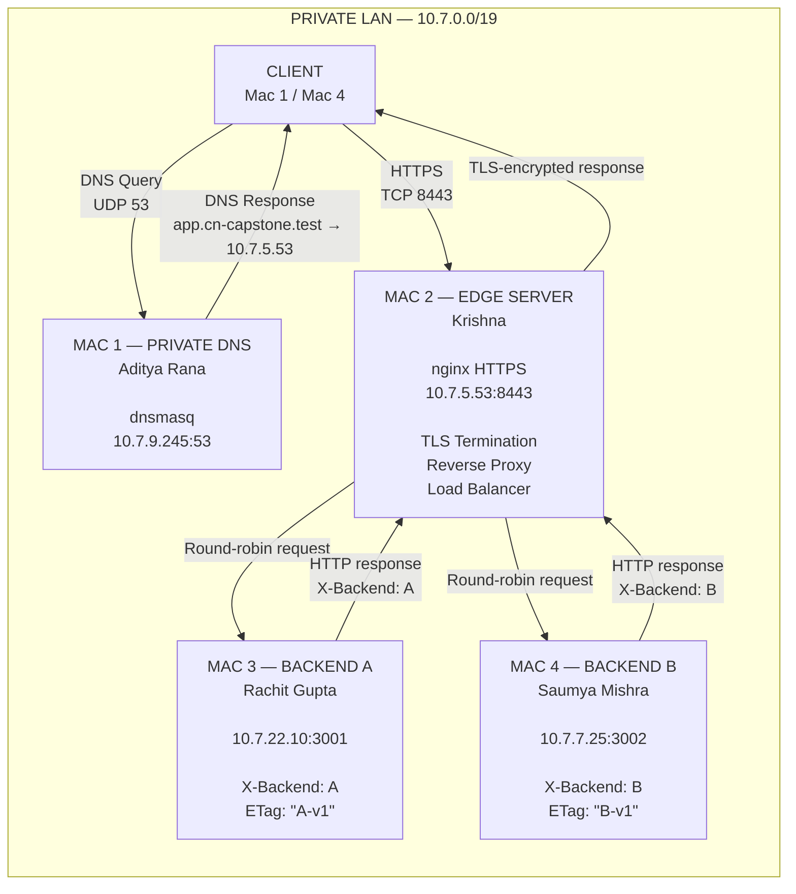
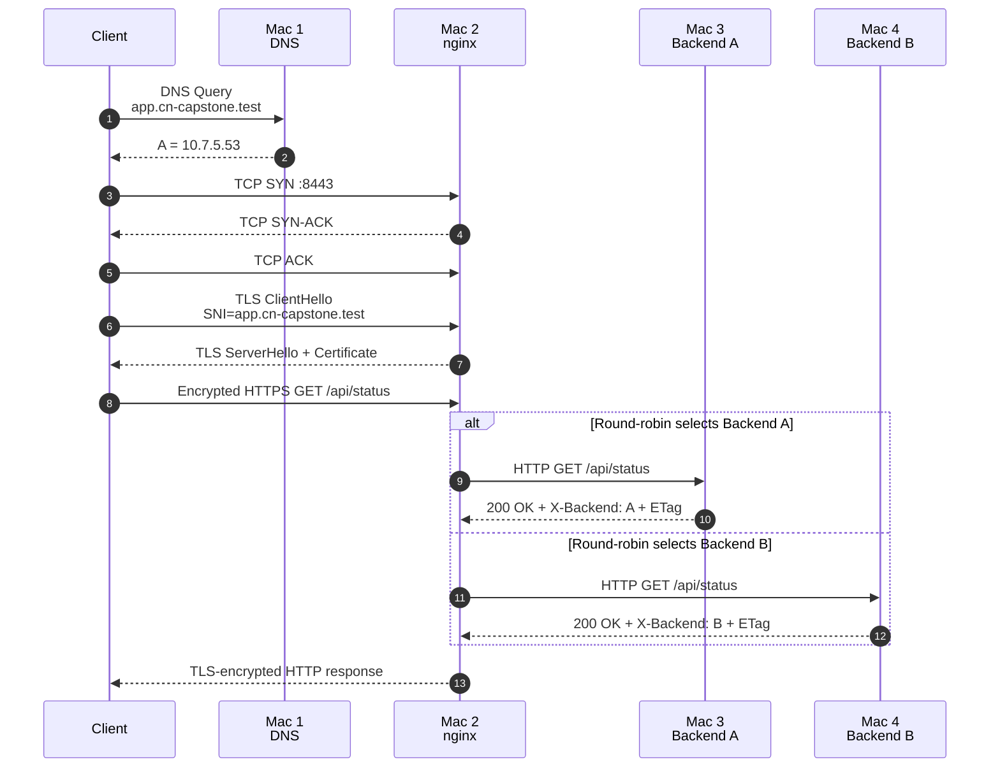
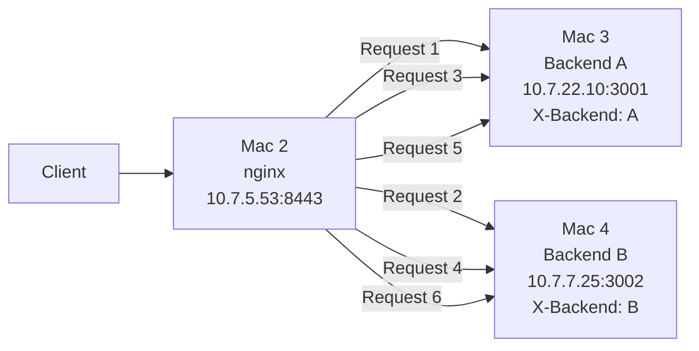
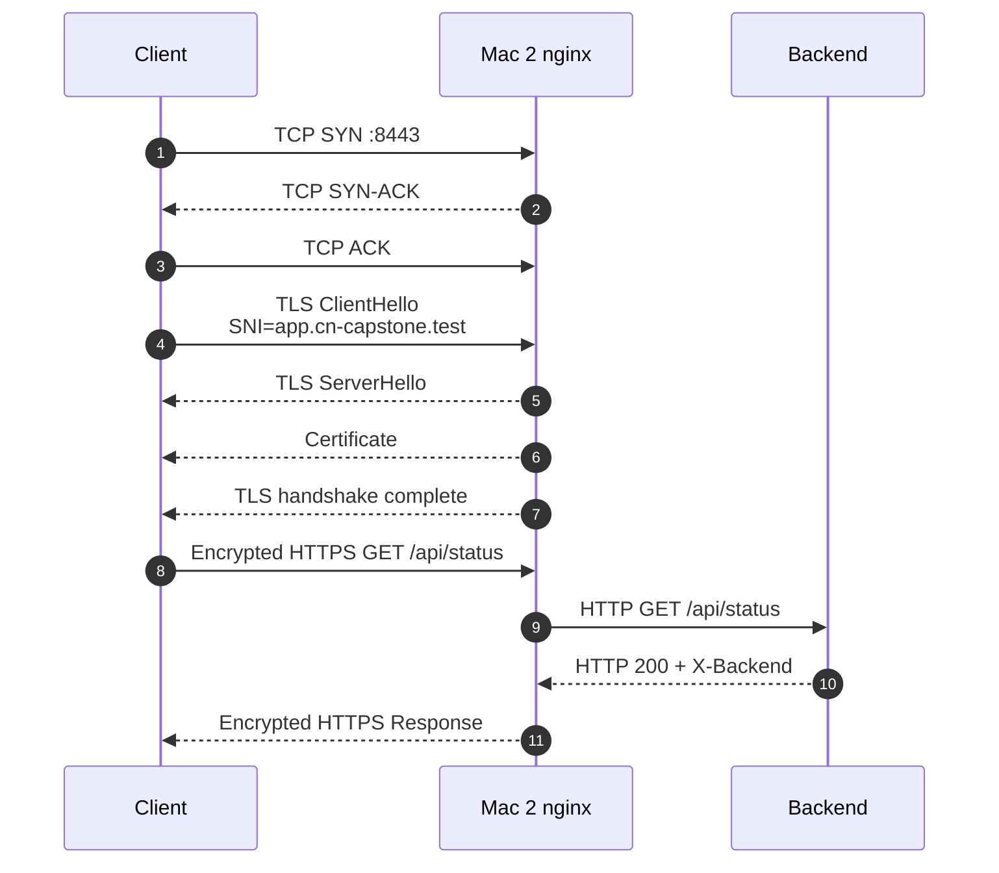
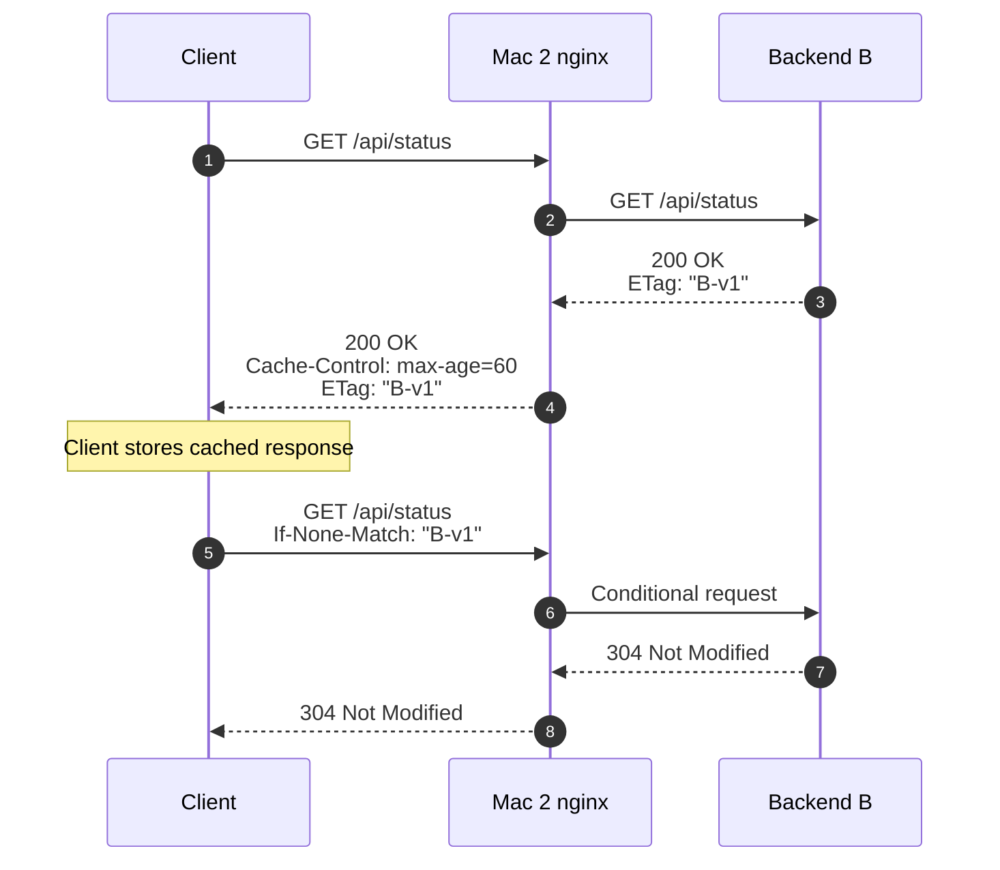
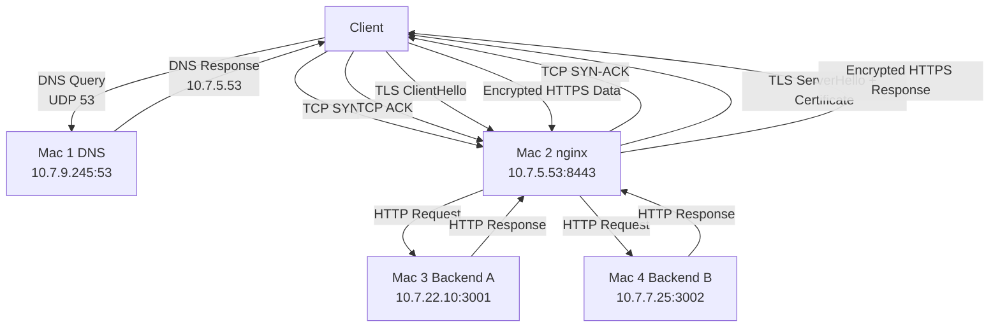
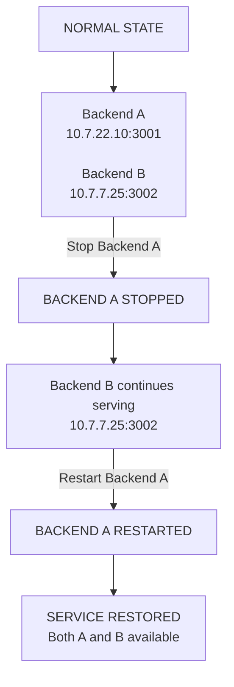
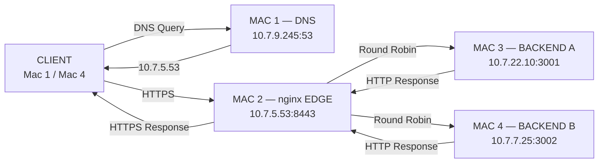
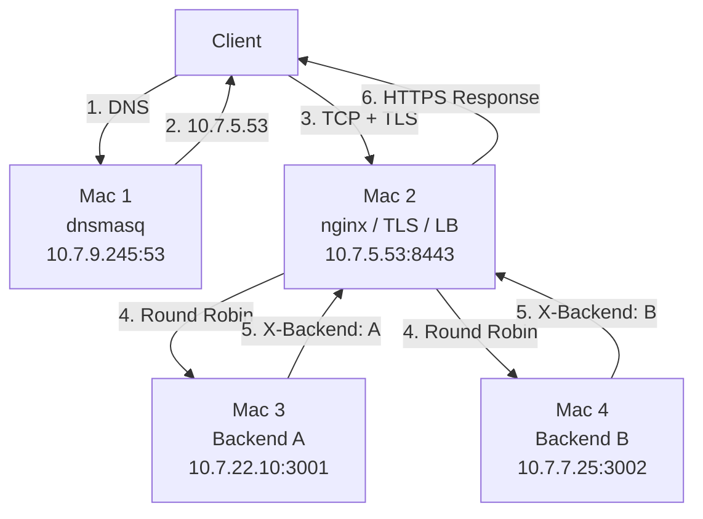

# Private Network Service Platform

## Computer Networks Course Project — Phase 1: Build & Observe

> **Core Principle:**  
> *"The application stays simple; the network is the project."*

---

## 1. Project Purpose & Overview

This project implements a private network service platform across four physical macOS workstations connected to the same local network.

The project demonstrates the complete lifecycle of a client request:

1. A client accesses the application using the private domain `app.cn-capstone.test`.
2. Mac 1 resolves the domain using `dnsmasq`.
3. The client establishes an HTTPS connection to Mac 2.
4. Mac 2 terminates TLS and acts as the reverse proxy and load balancer.
5. nginx forwards requests to Backend A or Backend B.
6. The backend returns HTTP responses containing backend identity and caching headers.
7. The team verifies DNS, TCP, TLS, HTTP, caching, load balancing, and packet-level behavior using tools such as `curl`, `dig`, `openssl`, and Wireshark.

The project uses the reserved `.test` namespace and does not depend on a public DNS provider.

---

# 2. Team Organization & Machine Roles

| Machine | Team Member | Primary Role | Main Service | Port |
|---|---|---|---|---:|
| **Mac 1** | **Aditya Rana** | Private DNS Server + Client | `dnsmasq` | `53` |
| **Mac 2** | **Krishna** | Edge Reverse Proxy + Load Balancer + TLS Termination | `nginx` | `8443` |
| **Mac 3** | **Rachit Gupta** | Backend Application Server A | Python HTTP service | `3001` |
| **Mac 4** | **Saumya Mishra** | Backend Application Server B + Client | Python HTTP service | `3002` |

### Role Summary

### Mac 1 — Private DNS

Mac 1 provides the private DNS service for the project.

```text
app.cn-capstone.test  →  10.7.5.53
api.cn-capstone.test  →  10.7.5.53
```

Main responsibility:

- Private DNS resolution
- `dnsmasq`
- Client-side testing
- DNS packet evidence

### Mac 2 — Edge Server

Mac 2 is the single HTTPS entry point for the project.

Main responsibilities:

- HTTPS termination
- TLS certificate handling
- Reverse proxying
- Round-robin load balancing
- Forwarding requests to Backend A and Backend B

### Mac 3 — Backend A

Backend A provides the first application service:

```text
10.7.22.10:3001
```

Backend identity:

```text
X-Backend: A
```

### Mac 4 — Backend B

Backend B provides the second application service:

```text
10.7.7.25:3002
```

Backend identity:

```text
X-Backend: B
```

---

# 3. Final Network Inventory

The final documented Phase 1 topology uses the following addressing scheme.

| Machine | Hostname | IPv4 Address | Subnet Mask | CIDR | Gateway | Interface | Main Service |
|---|---|---:|---|---|---:|---|---|
| **Mac 1** | `cn-dns` | `10.7.9.245` | `255.255.224.0` | `/19` | `10.7.0.1` | `en0` | DNS `:53` |
| **Mac 2** | `cn-edge` | `10.7.5.53` | `255.255.224.0` | `/19` | `10.7.0.1` | `en0` | nginx HTTPS `:8443` |
| **Mac 3** | `Rachits-MacBook-Pro-4.local` | `10.7.22.10` | `255.255.224.0` | `/19` | `10.7.0.1` | `en0` | Backend A `:3001` |
| **Mac 4** | `Saumyas-MacBook-Pro-3.local` | `10.7.7.25` | `255.255.224.0` | `/19` | `10.7.0.1` | `en0` | Backend B `:3002` |

### Subnet

```text
Network:
10.7.0.0/19

Subnet Mask:
255.255.224.0

Default Gateway:
10.7.0.1
```

### Private Namespace

```text
Primary application:
app.cn-capstone.test

API:
api.cn-capstone.test

Reserved TLD:
.test
```

---

# 4. End-to-End Network Topology

## 4.1 Mermaid Topology Diagram



---

# 5. End-to-End Request Flow

## 5.1 Mermaid Request Sequence



## 5.2 Request Lifecycle

1. **DNS Lookup**
   - The client asks Mac 1 for `app.cn-capstone.test`.
   - DNS uses UDP port `53`.

2. **DNS Response**
   - Mac 1 returns the Mac 2 address:
   - `app.cn-capstone.test → 10.7.5.53`

3. **TCP Connection**
   - The client connects to:
   - `10.7.5.53:8443`
   - TCP establishes a `SYN → SYN-ACK → ACK` handshake.

4. **TLS Handshake**
   - Mac 2 terminates TLS.
   - The certificate identifies `app.cn-capstone.test`.

5. **Encrypted HTTPS Request**
   - The client sends an encrypted request such as:
   - `GET /api/status`

6. **Reverse Proxy**
   - nginx decrypts the request.
   - nginx selects a backend from its upstream pool.

7. **Backend Processing**
   - Backend A or Backend B processes the HTTP request.
   - The response identifies the selected backend using `X-Backend`.

8. **Client Response**
   - nginx returns the response through the existing TLS connection.

---

# 6. OSI / TCP-IP Mapping

| OSI Layer | TCP/IP Layer | Protocol / Technology | Project Implementation | Verification |
|---|---|---|---|---|
| Layer 7 | Application | DNS | `dnsmasq` resolving `.test` domain | `dig`, `nslookup`, Wireshark |
| Layer 7 | Application | HTTP/1.1 | `/`, `/api/status`, backend headers | `curl -i` |
| Layer 6 | Application | TLS | TLS termination on Mac 2 | `curl -v`, `openssl`, Wireshark |
| Layer 5 | Application | TLS session | Session negotiation and secure connection | TLS handshake evidence |
| Layer 4 | Transport | TCP | Port `8443`, `3001`, `3002` | `lsof`, Wireshark |
| Layer 4 | Transport | UDP | DNS on port `53` | Wireshark |
| Layer 3 | Internet | IPv4 | `10.7.0.0/19` private network | `ifconfig`, `ping` |
| Layer 2 | Link | Wi-Fi / Ethernet | LAN communication | `arp`, interface status |
| Layer 1 | Physical | Wireless / physical medium | Physical network connectivity | Interface status |

---

# 7. Phase 1 Mandatory Tasks

## Task A — Establish the Private LAN

### Objective

Connect all four macOS machines to the project LAN and verify their addressing.

### Interface Check

```bash
ifconfig en0 | grep "inet "
```

### Routing Check

```bash
netstat -nr
```

### Host Connectivity Tests

```bash
ping -c 3 10.7.9.245
ping -c 3 10.7.5.53
ping -c 3 10.7.22.10
ping -c 3 10.7.7.25
```

### Success Criteria

The intended criterion is successful host-to-host communication across the project LAN.

The final README should not claim perfect `0%` packet loss unless the specific submitted evidence shows that result.

---

# 8. Task B — Private DNS

Mac 1 runs the project's private DNS service using `dnsmasq`.

## dnsmasq Configuration

```conf
port=53
listen-address=127.0.0.1,10.7.9.245
bind-interfaces
no-resolv
server=8.8.8.8
cache-size=1000
local-ttl=30
interface=en0

address=/app.cn-capstone.test/10.7.5.53
address=/api.cn-capstone.test/10.7.5.53
```

## DNS Verification

```bash
dig @10.7.9.245 app.cn-capstone.test
```

Expected:

```text
status: NOERROR

ANSWER:
app.cn-capstone.test. 30 IN A 10.7.5.53

SERVER:
10.7.9.245#53
```

## Public DNS Comparison

```bash
dig @8.8.8.8 app.cn-capstone.test
```

The project evidence showed:

```text
status: NXDOMAIN
```

This confirms that the project hostname is intentionally private to the project's DNS environment.

---

# 9. Task C — Backend Services

## Backend A — Mac 3

### Address

```text
10.7.22.10:3001
```

### Check Listening Socket

```bash
lsof -nP -iTCP:3001 -sTCP:LISTEN
```

### Local Test

```bash
curl -i http://127.0.0.1:3001/api/status
```

Expected response characteristics:

```text
HTTP/1.0 200 OK
X-Backend: A
Cache-Control: max-age=60
ETag: "A-v1"
```

### Edge Test

From Mac 2:

```bash
curl -i http://10.7.22.10:3001/api/status
```

---

## Backend B — Mac 4

### Address

```text
10.7.7.25:3002
```

### Check Listening Socket

```bash
lsof -nP -iTCP:3002 -sTCP:LISTEN
```

### Local Test

```bash
curl -i http://127.0.0.1:3002/api/status
```

Expected response characteristics:

```text
HTTP/1.0 200 OK
X-Backend: B
Cache-Control: max-age=60
ETag: "B-v1"
```

### Edge Test

From Mac 2:

```bash
curl -i http://10.7.7.25:3002/api/status
```

---

# 10. Task D — Edge Reverse Proxy and Load Balancer

Mac 2 is the single application entry point.

Public endpoint:

```text
https://app.cn-capstone.test:8443
```

Backend pool:

```text
Backend A:
10.7.22.10:3001

Backend B:
10.7.7.25:3002
```

## nginx Upstream

```nginx
upstream backend_pool {
    server 10.7.22.10:3001;
    server 10.7.7.25:3002;
}
```

## nginx HTTPS Server

```nginx
server {
    listen 8443 ssl;
    server_name app.cn-capstone.test;

    ssl_certificate /opt/homebrew/etc/nginx/certs/server.crt;
    ssl_certificate_key /opt/homebrew/etc/nginx/certs/server.key;

    location / {
        proxy_pass http://backend_pool;
        proxy_http_version 1.1;

        proxy_set_header Host $host;
        proxy_set_header X-Real-IP $remote_addr;
        proxy_set_header X-Forwarded-For $proxy_add_x_forwarded_for;
        proxy_set_header X-Forwarded-Proto https;

        proxy_set_header Connection "";
    }
}
```

## nginx Validation

```bash
nginx -t
```

Expected:

```text
syntax is ok
test is successful
```

---

# 11. Load Balancing Verification

## Six-Request Test

```bash
for i in {1..6}; do
    echo "REQUEST $i"
    curl -si https://app.cn-capstone.test:8443/api/status \
        | grep -E '^HTTP/|^X-Backend:'
done
```

Observed final evidence:

```text
REQUEST 1
HTTP/1.1 200 OK
X-Backend: A

REQUEST 2
HTTP/1.1 200 OK
X-Backend: B

REQUEST 3
HTTP/1.1 200 OK
X-Backend: A

REQUEST 4
HTTP/1.1 200 OK
X-Backend: B

REQUEST 5
HTTP/1.1 200 OK
X-Backend: A

REQUEST 6
HTTP/1.1 200 OK
X-Backend: B
```

---

# 12. Mermaid Load Balancing Diagram



---

# 13. Task E — HTTPS / TLS

Mac 2 performs TLS termination.

## Public Endpoint

```text
https://app.cn-capstone.test:8443
```

## Certificate Files

```text
/opt/homebrew/etc/nginx/certs/server.crt
/opt/homebrew/etc/nginx/certs/server.key
```

## Strict HTTPS Test

The final test must not use `-k`.

```bash
curl -v https://app.cn-capstone.test:8443/api/status
```

The verified project evidence showed:

```text
Host app.cn-capstone.test:8443 was resolved
IPv4: 10.7.5.53
Connected to 10.7.5.53 port 8443
TLS 1.3
Certificate subject CN: app.cn-capstone.test
SAN matches app.cn-capstone.test
SSL certificate verify ok
HTTP/1.1 200 OK
```

---

# 14. Mermaid TLS Diagram



---

# 15. Task F — HTTP Caching

The application demonstrates HTTP caching through:

```text
Cache-Control: max-age=60
```

and ETags:

```text
Backend A:
ETag: "A-v1"

Backend B:
ETag: "B-v1"
```

## Initial Request

```bash
curl -i https://app.cn-capstone.test:8443/api/status
```

Example response:

```text
HTTP/1.1 200 OK
Cache-Control: max-age=60
ETag: "B-v1"
X-Backend: B
```

## Conditional Validation

```bash
curl -i \
  -H 'If-None-Match: "B-v1"' \
  https://app.cn-capstone.test:8443/api/status
```

When the representation remains unchanged, the backend can return:

```text
HTTP/1.1 304 Not Modified
```

The `304` response allows the client to reuse its cached representation instead of receiving the full response body again.

---

# 16. Mermaid Cache Validation Diagram



---

# 17. Task G — Wireshark Protocol Analysis

## Evidence Ownership

Wireshark is a **project-level protocol analysis task**.

The submitted Wireshark evidence was captured from the client-side environment, including Mac 1.

Therefore:

- Mac 1 documentation may include the captured Wireshark evidence.
- Mac 2 documentation should not claim that Mac 2 itself captured the Wireshark screenshots unless that was actually done.
- Mac 3 documentation should focus on Backend A evidence.
- Mac 4 documentation should focus on Backend B evidence.

## Protocol Evidence

### DNS

```text
Client
   |
   | UDP 53
   v
Mac 1 DNS
   |
   | app.cn-capstone.test → 10.7.5.53
   v
Client
```

### TCP

```text
Client → Mac 2
SYN

Mac 2 → Client
SYN-ACK

Client → Mac 2
ACK
```

### TLS

```text
ClientHello
    |
ServerHello
    |
Certificate
    |
Handshake Complete
    |
Encrypted Application Data
```

### Useful Wireshark Filters

DNS:

```text
dns
```

DNS UDP:

```text
udp.port == 53
```

HTTPS TCP:

```text
tcp.port == 8443
```

TLS:

```text
tls
```

---

# 18. Mermaid Packet Flow



---

# 19. Failure Demonstration

The documented failure demonstration uses the backend-failure scenario.

## Normal State

Both backends are available:

```text
Backend A
10.7.22.10:3001

Backend B
10.7.7.25:3002
```

Normal public requests show both:

```text
X-Backend: A
X-Backend: B
```

## Failure Action

Backend A is stopped on Mac 3:

```text
10.7.22.10:3001
```

The edge remains available and requests continue through Backend B.

Observed public behavior during the failure:

```text
X-Backend: B
```

## Recovery

Backend A is started again.

The application returns to normal operation and both backend identities become available again:

```text
X-Backend: A
X-Backend: B
```

## Failure Layer

```text
Affected:
Backend / Application Layer

Unaffected:
DNS
nginx Edge
TLS Entry Point

Affected Service:
Backend A :3001
```

---

# 20. Mermaid Failure / Recovery Diagram



---

# 21. Verification Commands by Machine

## Mac 1 — DNS

### Check IP

```bash
ipconfig getifaddr en0
```

### Check dnsmasq

```bash
sudo lsof -nP -iUDP:53
sudo lsof -nP -iTCP:53
```

### DNS Resolution

```bash
dig @10.7.9.245 app.cn-capstone.test
```

### Public DNS Comparison

```bash
dig @8.8.8.8 app.cn-capstone.test
```

---

## Mac 2 — Edge

### Check IP

```bash
ipconfig getifaddr en0
```

### Validate nginx

```bash
nginx -t
```

### Check HTTPS Port

```bash
sudo lsof -nP -iTCP:8443 -sTCP:LISTEN
```

### Test Backend A

```bash
curl -i http://10.7.22.10:3001/api/status
```

### Test Backend B

```bash
curl -i http://10.7.7.25:3002/api/status
```

### Test HTTPS

```bash
curl -v https://app.cn-capstone.test:8443/api/status
```

### Test Load Balancing

```bash
for i in {1..6}; do
    echo "REQUEST $i"
    curl -si https://app.cn-capstone.test:8443/api/status \
        | grep -E '^HTTP/|^X-Backend:'
done
```

---

## Mac 3 — Backend A

### Check IP

```bash
ipconfig getifaddr en0
```

### Check Backend A

```bash
lsof -nP -iTCP:3001 -sTCP:LISTEN
```

### Local Test

```bash
curl -i http://127.0.0.1:3001/api/status
```

---

## Mac 4 — Backend B

### Check IP

```bash
ipconfig getifaddr en0
```

### Check Backend B

```bash
lsof -nP -iTCP:3002 -sTCP:LISTEN
```

### Local Test

```bash
curl -i http://127.0.0.1:3002/api/status
```

---

# 22. Evidence Allocation

| Evidence / Task | Primary Machine / Source |
|---|---|
| LAN identity | All Macs |
| DNS configuration | Mac 1 |
| DNS resolution | Mac 1 / client |
| Backend A service | Mac 3 |
| Backend B service | Mac 4 |
| nginx configuration | Mac 2 |
| TLS termination | Mac 2 |
| HTTPS verification | Client / Mac 2 path |
| Load balancing | Mac 2 / client |
| Cache headers | Backend + public edge |
| Cache validation / 304 | Backend + public edge |
| Wireshark | Client-side capture, including Mac 1 evidence |
| Backend A failure | Mac 3 |
| Public failover behavior | Mac 2 / client |
| End-to-end application test | Client + Mac 2 |

> Evidence should always be attributed to the machine where the command, service, capture, or observation was actually performed.

---

# 23. Review 1 Marks Breakdown

| Review Area | Tasks | Marks |
|---|---|---:|
| LAN Setup + Private DNS | Task A + Task B | 10 |
| HTTP/REST Backends + Proxy + Load Balancing | Task C + Task D | 10 |
| HTTPS / TLS Correctness | Task E | 8 |
| Packet Analysis & Protocol Flow | Task G | 7 |
| HTTP Caching | Task F | 5 |
| Individual Viva | Viva Voce | 10 |
| **Total** | | **50** |

---

# 24. Automated Testing

Run the project-wide test harness:

```bash
./tests/run-all-tests.sh
```

Individual tests:

```bash
./tests/dns-test.sh
./tests/https-test.sh
./tests/load-balancing-test.sh
./tests/caching-test.sh
./tests/failure-tests.sh
```

### Test Responsibilities

```text
dns-test.sh
    ↓
Task B — DNS verification

https-test.sh
    ↓
Task E — HTTPS / TLS verification

load-balancing-test.sh
    ↓
Task D — nginx load balancing

caching-test.sh
    ↓
Task F — Cache-Control / ETag / 304

failure-tests.sh
    ↓
Failure demonstration
```

---

# 25. Recommended Repository Structure

```text
cn-capstone/
├── README.md
│
├── edge/
│   ├── README.md
│   └── nginx.conf.example
│
├── tls/
│   ├── README.md
│   └── openssl.cnf.example
│
├── dns/
│   ├── dnsmasq.conf.example
│   ├── project.conf.example
│   └── README.md
│
├── backend-a/
│   ├── README.md
│   └── server.py
│
├── backend-b/
│   ├── README.md
│   └── server.py
│
├── tests/
│   ├── run-all-tests.sh
│   ├── dns-test.sh
│   ├── https-test.sh
│   ├── load-balancing-test.sh
│   ├── caching-test.sh
│   └── failure-tests.sh
│
├── evidence/
│   ├── README.md
│   ├── task-a/
│   ├── task-b/
│   ├── task-c/
│   ├── task-d/
│   ├── task-e/
│   ├── task-f/
│   ├── task-g/
│   └── failures/
│
└── docs/
    ├── architecture.md
    ├── network-topology.md
    ├── setup-guide.md
    └── troubleshooting.md
```

---

# 26. Final Architecture Diagram



---

# 27. Final Project Summary

The final Phase 1 architecture consists of four physical macOS machines.

```text
Mac 1
Private DNS
10.7.9.245:53
        |
        | app.cn-capstone.test → 10.7.5.53
        v
Mac 2
nginx Edge / TLS / Reverse Proxy / Load Balancer
10.7.5.53:8443
        |
        +--------------------------+
        |                          |
        v                          v
Mac 3                    Mac 4
Backend A                Backend B
10.7.22.10:3001          10.7.7.25:3002
X-Backend: A             X-Backend: B
```

The project demonstrates:

- Private DNS using `dnsmasq`
- Private `.test` namespace
- IPv4 LAN communication
- TCP connectivity
- HTTPS and TLS termination
- nginx reverse proxying
- Round-robin load balancing
- Backend identification with `X-Backend`
- HTTP caching with `Cache-Control`
- ETag validation
- `304 Not Modified`
- Backend failure and recovery
- DNS, TCP and TLS packet analysis
- End-to-end client request flow

---

## Final Endpoint Summary

| Component | Address |
|---|---|
| Private DNS | `10.7.9.245:53` |
| HTTPS Edge | `10.7.5.53:8443` |
| Backend A | `10.7.22.10:3001` |
| Backend B | `10.7.7.25:3002` |
| Application | `https://app.cn-capstone.test:8443` |
| API Alias | `api.cn-capstone.test` |
| Private Namespace | `.test` |

---

## Core Request Path



---

# End of README
