# Private Network Service Platform

## Computer Networks Course Project — Phase 1: Build & Observe

> **Core Principle:**  
> *"The application stays simple; the network is the project."*

---

# 1. Project Purpose & Overview

This project implements a private network service platform across four physical macOS workstations connected to the same local network.

The project demonstrates the complete lifecycle of a client request:

1. A client accesses the application using the private domain `app.cn-capstone.test`.
2. Mac 1 resolves the domain using `dnsmasq`.
3. The client establishes an HTTPS connection to Mac 2.
4. Mac 2 terminates TLS and acts as the reverse proxy and load balancer.
5. nginx forwards requests to Backend A or Backend B.
6. The selected backend returns an HTTP response containing backend identification and caching headers.
7. The project can be observed across DNS, TCP, TLS and HTTP layers.
8. Wireshark evidence is treated as a project-level packet-analysis activity and is not attributed to Mac 2 unless the capture was actually performed there.

The project uses the reserved `.test` namespace.

---

# 2. Team Organization & Machine Roles

| Machine | Team Member | Primary Role | Main Service | Port |
|---|---|---|---|---:|
| **Mac 1** | **Aditya Rana** | Private DNS Server + Client | `dnsmasq` | `53` |
| **Mac 2** | **Krishna** | Edge Reverse Proxy + Load Balancer + TLS Termination | `nginx` | `8443` |
| **Mac 3** | **Rachit Gupta** | Backend Application Server A | Python HTTP service | `3001` |
| **Mac 4** | **Saumya Mishra** | Backend Application Server B + Client | Python HTTP service | `3002` |

## 2.1 Machine Responsibilities

### Mac 1 — Private DNS Server

```text
Hostname:
cn-dns

IP:
10.7.9.245

DNS:
10.7.9.245:53

Service:
dnsmasq
```

Private records:

```text
app.cn-capstone.test  →  10.7.5.53
api.cn-capstone.test  →  10.7.5.53
```

Mac 1 also acts as one of the client-side environments used for project verification and packet evidence.

---

### Mac 2 — Edge / Reverse Proxy / Load Balancer

```text
Hostname:
cn-edge

IP:
10.7.5.53

HTTPS:
10.7.5.53:8443

Service:
nginx
```

Responsibilities:

- TLS termination
- HTTPS entry point
- Reverse proxy
- Round-robin load balancing
- Forwarding requests to Backend A
- Forwarding requests to Backend B

Mac 2 does **not** serve as the Wireshark evidence owner in this documentation.

---

### Mac 3 — Backend A

```text
IP:
10.7.22.10

Port:
3001

Service:
Python HTTP server

Identity:
X-Backend: A
```

---

### Mac 4 — Backend B

```text
IP:
10.7.7.25

Port:
3002

Service:
Python HTTP server

Identity:
X-Backend: B
```

---

# 3. Final Network Inventory

| Machine | Hostname | IPv4 Address | Subnet Mask | CIDR | Gateway | Interface | Main Service |
|---|---|---|---|---|---|---|---|
| **Mac 1** | `cn-dns` | `10.7.9.245` | `255.255.224.0` | `/19` | `10.7.0.1` | `en0` | DNS `:53` |
| **Mac 2** | `cn-edge` | `10.7.5.53` | `255.255.224.0` | `/19` | `10.7.0.1` | `en0` | nginx HTTPS `:8443` |
| **Mac 3** | `Rachits-MacBook-Pro-4.local` | `10.7.22.10` | `255.255.224.0` | `/19` | `10.7.0.1` | `en0` | Backend A `:3001` |
| **Mac 4** | `Saumyas-MacBook-Pro-3.local` | `10.7.7.25` | `255.255.224.0` | `/19` | `10.7.0.1` | `en0` | Backend B `:3002` |

## 3.1 Network Parameters

```text
Network:
10.7.0.0/19

Subnet Mask:
255.255.224.0

Default Gateway:
10.7.0.1

Interface:
en0
```

## 3.2 Private Namespace

```text
Primary application:
app.cn-capstone.test

API:
api.cn-capstone.test

Reserved namespace:
.test
```

---

# 4. Final Architecture

## 4.1 Main Architecture Diagram

This version intentionally keeps the connection lines free of text labels.  
The protocol steps are described in the legend below the diagram so that no line passes through a node.

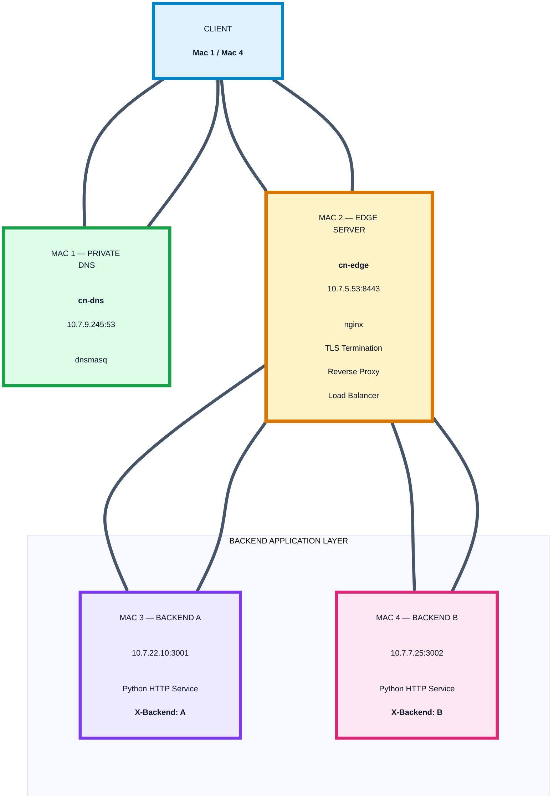

### Architecture Legend

| Step | Flow |
|---|---|
| **1** | Client → Mac 1: DNS query for `app.cn-capstone.test` |
| **2** | Mac 1 → Client: `10.7.5.53` returned |
| **3** | Client → Mac 2: HTTPS / TLS on TCP `8443` |
| **4A** | Mac 2 → Mac 3: HTTP request to Backend A |
| **4B** | Mac 2 → Mac 4: HTTP request to Backend B |
| **5A** | Mac 3 → Mac 2: `X-Backend: A` |
| **5B** | Mac 4 → Mac 2: `X-Backend: B` |
| **6** | Mac 2 → Client: encrypted HTTPS response |

---

# 5. End-to-End Request Flow

## 5.1 Request Sequence Diagram

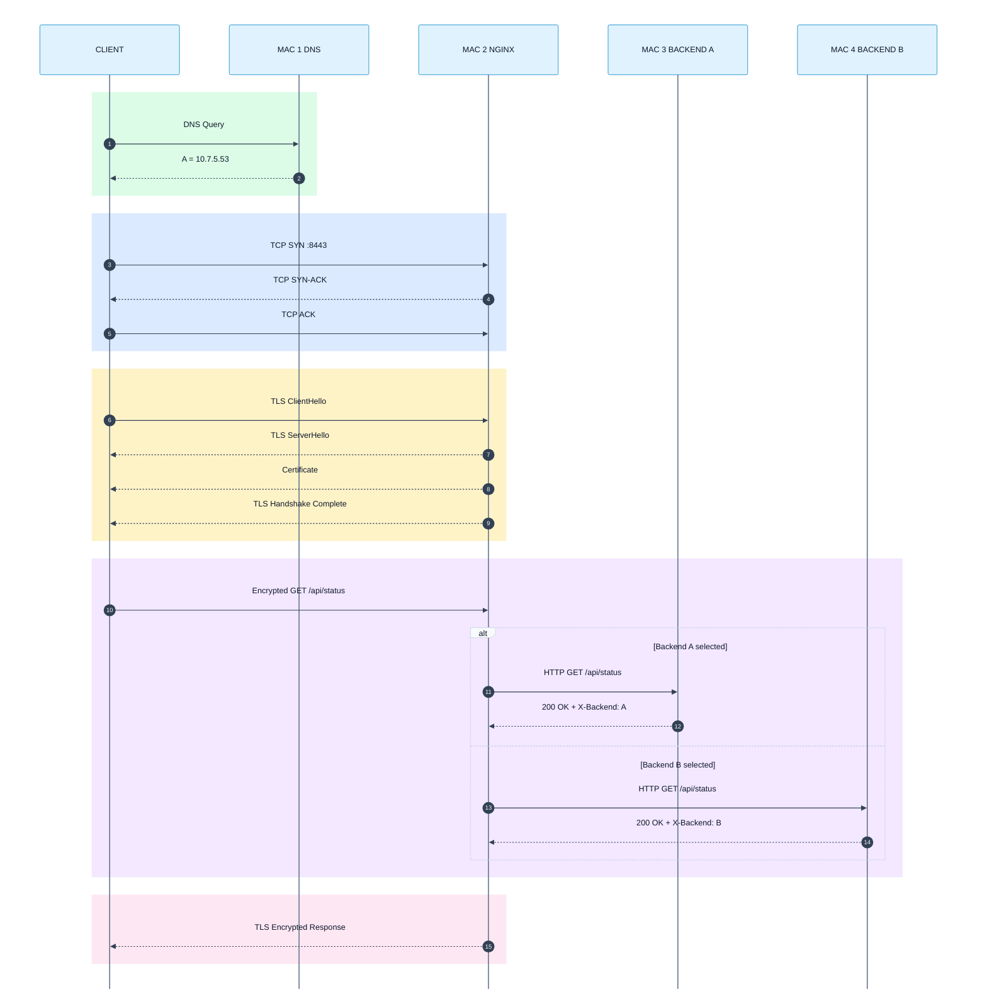

---

# 6. Service Architecture

## 6.1 DNS Service

Mac 1 runs:

```text
dnsmasq
```

DNS listens on:

```text
10.7.9.245:53
```

Project records:

```conf
address=/app.cn-capstone.test/10.7.5.53
address=/api.cn-capstone.test/10.7.5.53
```

---

## 6.2 Backend A

```text
Machine:
Mac 3

IP:
10.7.22.10

Port:
3001

Binding:
0.0.0.0:3001

Backend Identity:
A

Header:
X-Backend: A

ETag:
"A-v1"
```

---

## 6.3 Backend B

```text
Machine:
Mac 4

IP:
10.7.7.25

Port:
3002

Binding:
0.0.0.0:3002

Backend Identity:
B

Header:
X-Backend: B

ETag:
"B-v1"
```

---

# 7. Task A — Private LAN

## Objective

Connect the four project machines to the same private network and verify their network configuration.

## Interface Check

```bash
ifconfig en0 | grep "inet "
```

## Routing Check

```bash
netstat -nr
```

## Connectivity Tests

```bash
ping -c 3 10.7.9.245
ping -c 3 10.7.5.53
ping -c 3 10.7.22.10
ping -c 3 10.7.7.25
```

## Important Evidence Note

The final README should not claim that every pairwise ping produced `0%` packet loss unless the submitted screenshots actually show that result.

The topology and addressing can be documented independently of individual ICMP results.

---

# 8. Task B — Private DNS

Mac 1 provides the project's private DNS service.

## 8.1 dnsmasq Configuration

```conf
port=53
listen-address=127.0.0.1,10.7.9.245
bind-interfaces
no-resolv
server=8.8.8.8
cache-size=1000
local-ttl=30
interface=en0

address=/app.cn-capstone.test/10.7.5.53
address=/api.cn-capstone.test/10.7.5.53
```

## 8.2 DNS Test

```bash
dig @10.7.9.245 app.cn-capstone.test
```

Expected project result:

```text
status: NOERROR

ANSWER:
app.cn-capstone.test. 30 IN A 10.7.5.53

SERVER:
10.7.9.245#53
```

## 8.3 Public DNS Comparison

```bash
dig @8.8.8.8 app.cn-capstone.test
```

The project evidence showed:

```text
status: NXDOMAIN
```

This demonstrates that the `.test` hostname is private to the project's DNS environment.

---

# 9. Task C — Backend Services

## 9.1 Backend A — Mac 3

### Address

```text
10.7.22.10:3001
```

### Check Listening Port

```bash
lsof -nP -iTCP:3001 -sTCP:LISTEN
```

### Local Test

```bash
curl -i http://127.0.0.1:3001/api/status
```

Expected response characteristics:

```text
HTTP/1.0 200 OK
X-Backend: A
Cache-Control: max-age=60
ETag: "A-v1"
```

### Test from Mac 2

```bash
curl -i http://10.7.22.10:3001/api/status
```

---

## 9.2 Backend B — Mac 4

### Address

```text
10.7.7.25:3002
```

### Check Listening Port

```bash
lsof -nP -iTCP:3002 -sTCP:LISTEN
```

### Local Test

```bash
curl -i http://127.0.0.1:3002/api/status
```

Expected response characteristics:

```text
HTTP/1.0 200 OK
X-Backend: B
Cache-Control: max-age=60
ETag: "B-v1"
```

### Test from Mac 2

```bash
curl -i http://10.7.7.25:3002/api/status
```

---

# 10. Task D — nginx Reverse Proxy and Load Balancer

Mac 2 is the unified HTTPS entry point.

## 10.1 nginx Upstream

```nginx
upstream backend_pool {
    server 10.7.22.10:3001;
    server 10.7.7.25:3002;
}
```

## 10.2 HTTPS Server

```nginx
server {
    listen 8443 ssl;
    server_name app.cn-capstone.test;

    ssl_certificate /opt/homebrew/etc/nginx/certs/server.crt;
    ssl_certificate_key /opt/homebrew/etc/nginx/certs/server.key;

    location / {
        proxy_pass http://backend_pool;

        proxy_http_version 1.1;

        proxy_set_header Host $host;
        proxy_set_header X-Real-IP $remote_addr;
        proxy_set_header X-Forwarded-For $proxy_add_x_forwarded_for;
        proxy_set_header X-Forwarded-Proto https;

        proxy_set_header Connection "";
    }
}
```

## 10.3 nginx Validation

```bash
nginx -t
```

Expected:

```text
syntax is ok
test is successful
```

## 10.4 Verify Port

```bash
sudo lsof -nP -iTCP:8443 -sTCP:LISTEN
```

Expected listener:

```text
*:8443
```

---

# 11. Task D — Load Balancing Verification

## Six-Request Test

```bash
for i in {1..6}; do
    echo "REQUEST $i"
    curl -si https://app.cn-capstone.test:8443/api/status \
        | grep -E '^HTTP/|^X-Backend:'
done
```

Observed project evidence:

```text
REQUEST 1
HTTP/1.1 200 OK
X-Backend: A

REQUEST 2
HTTP/1.1 200 OK
X-Backend: B

REQUEST 3
HTTP/1.1 200 OK
X-Backend: A

REQUEST 4
HTTP/1.1 200 OK
X-Backend: B

REQUEST 5
HTTP/1.1 200 OK
X-Backend: A

REQUEST 6
HTTP/1.1 200 OK
X-Backend: B
```

This confirms that both backend servers participate in the public request path.

---

# 12. Mermaid Load-Balancing Diagram

The request labels are deliberately removed from the arrows and placed inside dedicated nodes. This prevents text from sitting on top of connection lines.

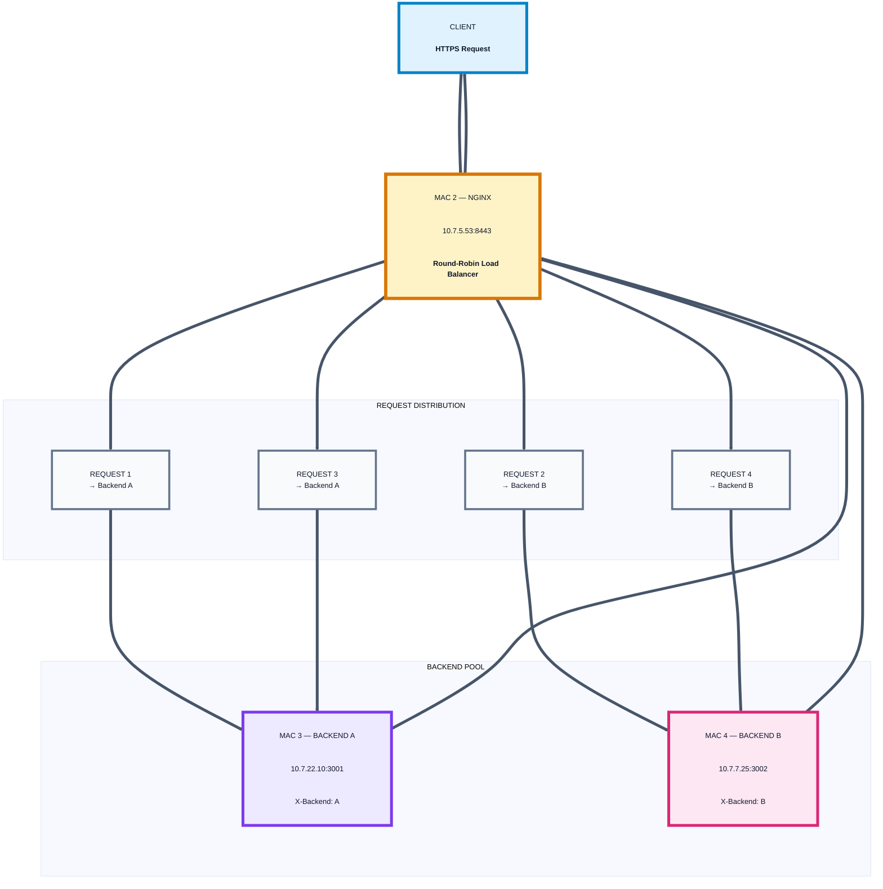

---

# 13. Task E — HTTPS / TLS

Mac 2 performs TLS termination.

## 13.1 Public Endpoint

```text
https://app.cn-capstone.test:8443
```

## 13.2 Certificate

Certificate:

```text
/opt/homebrew/etc/nginx/certs/server.crt
```

Private key:

```text
/opt/homebrew/etc/nginx/certs/server.key
```

## 13.3 Strict HTTPS Verification

The final verification must not use `-k`.

```bash
curl -v https://app.cn-capstone.test:8443/api/status
```

The verified project evidence showed:

```text
Host app.cn-capstone.test:8443 was resolved

IPv4:
10.7.5.53

Connected to:
10.7.5.53 port 8443

TLS:
TLS 1.3

Certificate:
CN = app.cn-capstone.test

SAN:
app.cn-capstone.test

Certificate verification:
SSL certificate verify ok

HTTP:
HTTP/1.1 200 OK
```

Example response body:

```json
{
  "backend": "B",
  "status": "ok",
  "service": "cn-project"
}
```

---

# 14. Mermaid TLS Diagram

No protocol text is placed directly on the arrows.

```mermaid
%%{init: {
  "theme": "base",
  "flowchart": {
    "htmlLabels": true,
    "nodeSpacing": 190,
    "rankSpacing": 230,
    "curve": "basis",
    "padding": 45
  },
  "themeVariables": {
    "fontFamily": "Arial",
    "fontSize": "18px"
  }
}}%%

flowchart TB

    CLIENT["CLIENT<br/><br/><b>HTTPS Request</b>"]

    TCP["TCP CONNECTION<br/><br/>
    SYN<br/>
    SYN-ACK<br/>
    ACK"]

    TLS["TLS HANDSHAKE<br/><br/>
    ClientHello<br/>
    ServerHello<br/>
    Certificate<br/>
    Finished"]

    EDGE["MAC 2 — NGINX<br/><br/>
    <b>TLS Termination</b><br/>
    10.7.5.53:8443"]

    HTTP["DECRYPTED HTTP<br/><br/>
    GET /api/status"]

    BACKEND["BACKEND A / B<br/><br/>
    10.7.22.10:3001<br/>
    OR<br/>
    10.7.7.25:3002"]

    RESPONSE["RESPONSE<br/><br/>
    HTTP 200 OK<br/>
    X-Backend: A / B"]

    CLIENT --> TCP
    TCP --> TLS
    TLS --> EDGE
    EDGE --> HTTP
    HTTP --> BACKEND
    BACKEND --> RESPONSE
    RESPONSE --> EDGE
    EDGE --> CLIENT

    classDef client fill:#E0F2FE,stroke:#0284C7,stroke-width:7px,color:#0F172A;
    classDef tcp fill:#DBEAFE,stroke:#2563EB,stroke-width:7px,color:#0F172A;
    classDef tls fill:#FEF3C7,stroke:#D97706,stroke-width:7px,color:#0F172A;
    classDef edge fill:#FFEDD5,stroke:#EA580C,stroke-width:8px,color:#0F172A;
    classDef http fill:#DCFCE7,stroke:#16A34A,stroke-width:7px,color:#0F172A;
    classDef backend fill:#EDE9FE,stroke:#7C3AED,stroke-width:7px,color:#0F172A;
    classDef response fill:#FCE7F3,stroke:#DB2777,stroke-width:7px,color:#0F172A;

    class CLIENT client;
    class TCP tcp;
    class TLS tls;
    class EDGE edge;
    class HTTP http;
    class BACKEND backend;
    class RESPONSE response;

    linkStyle default stroke:#475569,stroke-width:7px;
```

---

# 15. Task F — HTTP Caching

The project demonstrates HTTP caching using `Cache-Control` and `ETag`.

## 15.1 Cache-Control

```text
Cache-Control: max-age=60
```

This indicates that the response can be treated as fresh for 60 seconds.

## 15.2 ETag

Backend A:

```text
ETag: "A-v1"
```

Backend B:

```text
ETag: "B-v1"
```

## 15.3 Initial Request

```bash
curl -i https://app.cn-capstone.test:8443/api/status
```

Example:

```text
HTTP/1.1 200 OK
Cache-Control: max-age=60
ETag: "B-v1"
X-Backend: B
```

## 15.4 Conditional Validation

```bash
curl -i \
  -H 'If-None-Match: "B-v1"' \
  https://app.cn-capstone.test:8443/api/status
```

When the representation is unchanged, the backend can return:

```text
HTTP/1.1 304 Not Modified
```

This lets the client use its cached representation without retransmitting the entire response body.

---

# 16. Mermaid Cache Validation Diagram

All explanatory text is inside nodes rather than on connection lines.

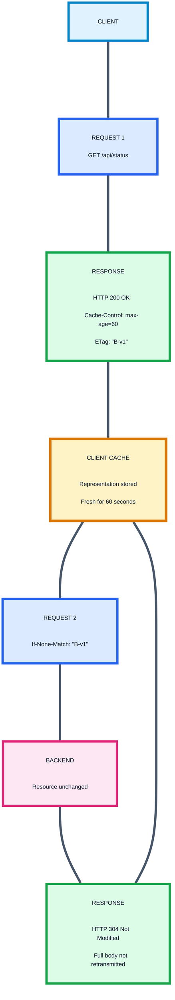

---

# 17. Task G — Wireshark Protocol Analysis

## 17.1 Evidence Ownership

Wireshark is a project-level packet-analysis task.

The available evidence was captured from the client-side environment, including Mac 1.

Therefore:

- Mac 1 documentation may include the Wireshark evidence.
- Mac 2 documentation should not claim that Mac 2 itself captured the Wireshark screenshots unless that was actually done.
- Mac 3 documentation focuses on Backend A.
- Mac 4 documentation focuses on Backend B.
- This section explains the complete project flow rather than assigning the packet capture to Mac 2.

---

# 18. DNS Packet Flow

The arrows contain no labels so they cannot overlap the nodes.

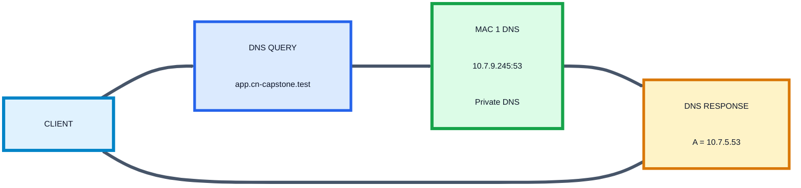

Wireshark filter:

```text
dns
```

---

# 19. TCP Three-Way Handshake

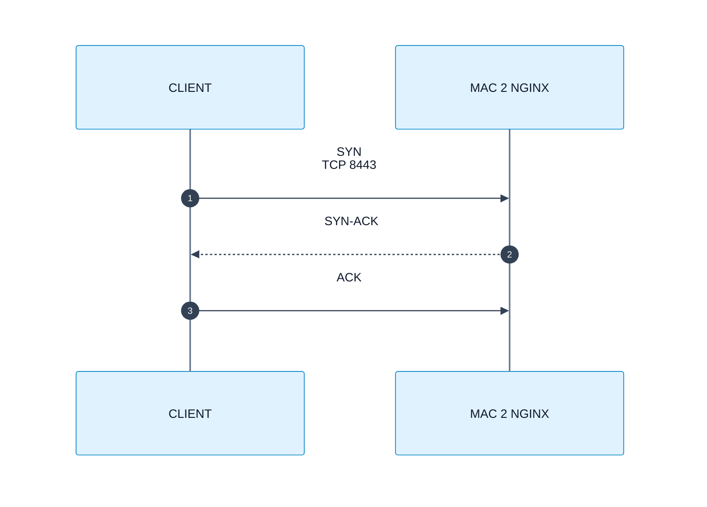

Wireshark filter:

```text
tcp.port == 8443
```

---

# 20. TLS Handshake

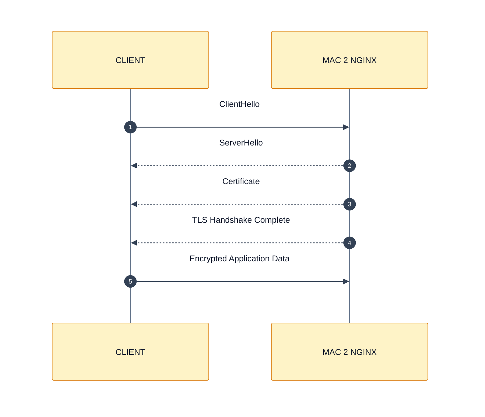

Wireshark filter:

```text
tls
```

---

# 21. Complete Packet Flow

Again, the connection lines have no text labels.

```mermaid
%%{init: {
  "theme": "base",
  "flowchart": {
    "htmlLabels": true,
    "nodeSpacing": 220,
    "rankSpacing": 230,
    "curve": "basis",
    "padding": 45
  },
  "themeVariables": {
    "fontFamily": "Arial",
    "fontSize": "18px"
  }
}}%%

flowchart TB

    DNS["1 — DNS<br/><br/>
    UDP 53<br/>
    app.cn-capstone.test<br/>
    → 10.7.5.53"]

    TCP["2 — TCP<br/><br/>
    Port 8443<br/>
    SYN → SYN-ACK → ACK"]

    TLS["3 — TLS<br/><br/>
    ClientHello<br/>
    ServerHello<br/>
    Certificate"]

    ENCRYPTED["4 — ENCRYPTED DATA<br/><br/>
    HTTPS Application Data<br/>
    Payload is encrypted"]

    HTTP["5 — APPLICATION PATH<br/><br/>
    nginx → Backend A / B<br/>
    HTTP/1.1"]

    RESPONSE["6 — RESPONSE<br/><br/>
    HTTP 200 OK<br/>
    X-Backend: A / B"]

    DNS --> TCP
    TCP --> TLS
    TLS --> ENCRYPTED
    ENCRYPTED --> HTTP
    HTTP --> RESPONSE

    classDef dns fill:#DCFCE7,stroke:#16A34A,stroke-width:7px,color:#0F172A;
    classDef tcp fill:#DBEAFE,stroke:#2563EB,stroke-width:7px,color:#0F172A;
    classDef tls fill:#FEF3C7,stroke:#D97706,stroke-width:7px,color:#0F172A;
    classDef encrypted fill:#EDE9FE,stroke:#7C3AED,stroke-width:7px,color:#0F172A;
    classDef http fill:#E0F2FE,stroke:#0284C7,stroke-width:7px,color:#0F172A;
    classDef response fill:#FCE7F3,stroke:#DB2777,stroke-width:7px,color:#0F172A;

    class DNS dns;
    class TCP tcp;
    class TLS tls;
    class ENCRYPTED encrypted;
    class HTTP http;
    class RESPONSE response;

    linkStyle default stroke:#475569,stroke-width:7px;
```

---

# 22. Task Failure Demonstration

The documented failure demonstration focuses on Backend A.

## 22.1 Normal State

Both backend services are available:

```text
Backend A:
10.7.22.10:3001

Backend B:
10.7.7.25:3002
```

The public application can return:

```text
X-Backend: A
```

and:

```text
X-Backend: B
```

## 22.2 Failure Action

Backend A is stopped on Mac 3:

```text
10.7.22.10:3001
```

The nginx edge and DNS service remain available.

## 22.3 During Failure

Public requests continue through Backend B:

```text
X-Backend: B
```

## 22.4 Recovery

Backend A is started again.

The public application returns to the normal state where both backend identities are available:

```text
X-Backend: A
X-Backend: B
```

---

# 23. Mermaid Failure / Recovery Diagram

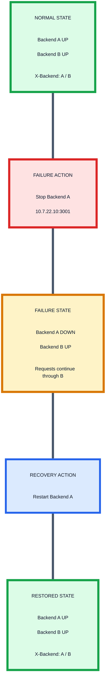

---

# 24. Verification Commands by Machine

## 24.1 Mac 1 — DNS

### IP

```bash
ipconfig getifaddr en0
```

### dnsmasq Listener

```bash
sudo lsof -nP -iUDP:53
sudo lsof -nP -iTCP:53
```

### DNS Test

```bash
dig @10.7.9.245 app.cn-capstone.test
```

### Public DNS Test

```bash
dig @8.8.8.8 app.cn-capstone.test
```

---

## 24.2 Mac 2 — Edge

### IP

```bash
ipconfig getifaddr en0
```

### nginx Test

```bash
nginx -t
```

### HTTPS Listener

```bash
sudo lsof -nP -iTCP:8443 -sTCP:LISTEN
```

### Backend A

```bash
curl -i http://10.7.22.10:3001/api/status
```

### Backend B

```bash
curl -i http://10.7.7.25:3002/api/status
```

### HTTPS

```bash
curl -v https://app.cn-capstone.test:8443/api/status
```

### Load Balancing

```bash
for i in {1..6}; do
    echo "REQUEST $i"
    curl -si https://app.cn-capstone.test:8443/api/status \
        | grep -E '^HTTP/|^X-Backend:'
done
```

---

## 24.3 Mac 3 — Backend A

### IP

```bash
ipconfig getifaddr en0
```

### Listener

```bash
lsof -nP -iTCP:3001 -sTCP:LISTEN
```

### Local API

```bash
curl -i http://127.0.0.1:3001/api/status
```

---

## 24.4 Mac 4 — Backend B

### IP

```bash
ipconfig getifaddr en0
```

### Listener

```bash
lsof -nP -iTCP:3002 -sTCP:LISTEN
```

### Local API

```bash
curl -i http://127.0.0.1:3002/api/status
```

---

# 25. Evidence Allocation

| Evidence / Task | Primary Machine / Source |
|---|---|
| LAN identity | All Macs |
| DNS configuration | Mac 1 |
| DNS resolution | Mac 1 / client |
| Backend A service | Mac 3 |
| Backend B service | Mac 4 |
| nginx configuration | Mac 2 |
| TLS termination | Mac 2 |
| HTTPS verification | Client / Mac 2 path |
| Load balancing | Mac 2 / client |
| Cache headers | Backend + public edge |
| Cache validation / 304 | Backend + public edge |
| Wireshark | Client-side capture, including Mac 1 evidence |
| Backend A failure | Mac 3 |
| Public failover behavior | Mac 2 / client |
| End-to-end application test | Client + Mac 2 |

> Evidence should always be attributed to the machine where the command, service, capture, or observation was actually performed.

---

# 26. Review 1 Marks Breakdown

| Review Area | Tasks | Marks |
|---|---|---:|
| LAN Setup + Private DNS | Task A + Task B | 10 |
| HTTP/REST Backends + Proxy + Load Balancing | Task C + Task D | 10 |
| HTTPS / TLS Correctness | Task E | 8 |
| Packet Analysis & Protocol Flow | Task G | 7 |
| HTTP Caching | Task F | 5 |
| Individual Viva | Viva Voce | 10 |
| **Total** | | **50** |

---

# 27. Automated Testing

Run the complete project test suite:

```bash
./tests/run-all-tests.sh
```

Individual tests:

```bash
./tests/dns-test.sh
./tests/https-test.sh
./tests/load-balancing-test.sh
./tests/caching-test.sh
./tests/failure-tests.sh
```

## 27.1 Test Mapping Diagram

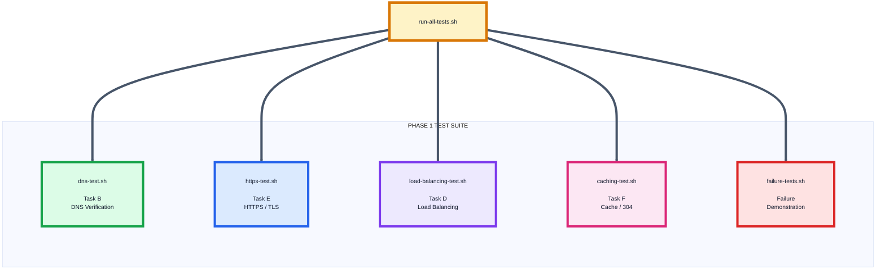

---

# 28. Recommended Repository Structure

```text
cn-capstone/
├── README.md
│
├── edge/
│   ├── README.md
│   └── nginx.conf.example
│
├── tls/
│   ├── README.md
│   └── openssl.cnf.example
│
├── dns/
│   ├── dnsmasq.conf.example
│   ├── project.conf.example
│   └── README.md
│
├── backend-a/
│   ├── README.md
│   └── server.py
│
├── backend-b/
│   ├── README.md
│   └── server.py
│
├── tests/
│   ├── run-all-tests.sh
│   ├── dns-test.sh
│   ├── https-test.sh
│   ├── load-balancing-test.sh
│   ├── caching-test.sh
│   └── failure-tests.sh
│
├── evidence/
│   ├── README.md
│   ├── task-a/
│   ├── task-b/
│   ├── task-c/
│   ├── task-d/
│   ├── task-e/
│   ├── task-f/
│   ├── task-g/
│   └── failures/
│
└── docs/
    ├── architecture.md
    ├── network-topology.md
    ├── setup-guide.md
    └── troubleshooting.md
```

---

# 29. Final Architecture Summary

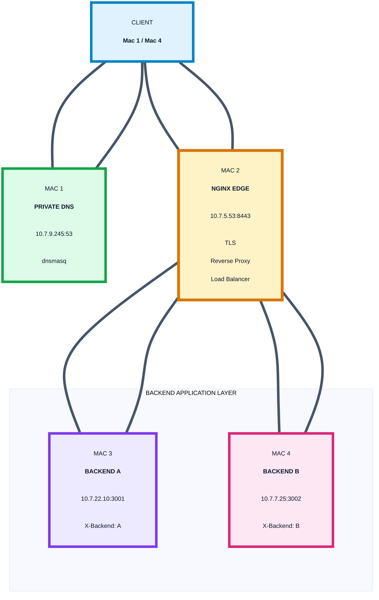

### Architecture Legend

```text
1. Client queries Mac 1 DNS.

2. Mac 1 returns:
   app.cn-capstone.test → 10.7.5.53

3. Client establishes HTTPS with Mac 2.

4. Mac 2 terminates TLS.

5. nginx selects Backend A or Backend B.

6. Backend returns the response.

7. nginx sends the HTTPS response to the client.
```

---

# 30. Final Endpoint Summary

| Component | Address |
|---|---|
| Private DNS | `10.7.9.245:53` |
| HTTPS Edge | `10.7.5.53:8443` |
| Backend A | `10.7.22.10:3001` |
| Backend B | `10.7.7.25:3002` |
| Application | `https://app.cn-capstone.test:8443` |
| API Alias | `api.cn-capstone.test` |
| Private Namespace | `.test` |

---

# 31. Core Request Path

This diagram also uses dedicated step nodes rather than putting long descriptions on arrows.

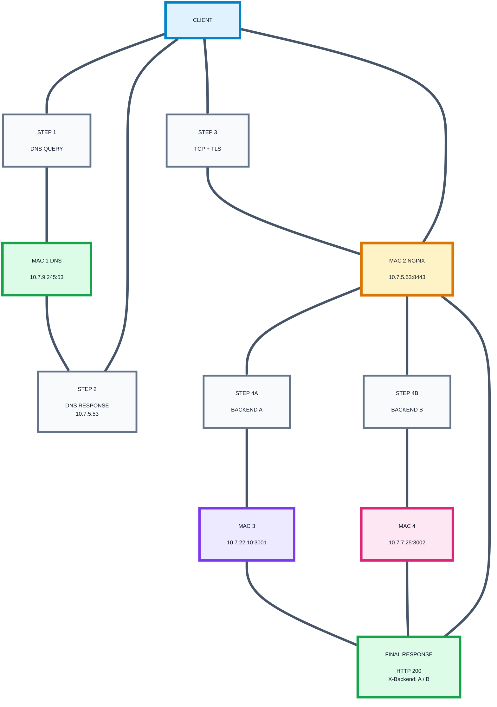

---

# 32. Final Project Summary

The final Phase 1 platform contains four physical macOS systems.

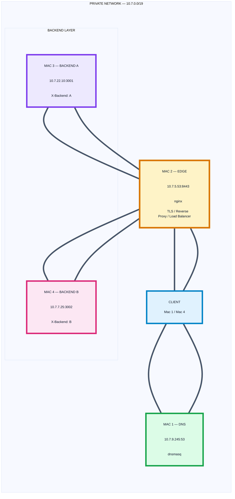

The project demonstrates:

- Private DNS using `dnsmasq`
- `.test` private namespace
- LAN addressing
- TCP connectivity
- HTTPS
- TLS termination
- nginx reverse proxying
- Round-robin load balancing
- Backend identification through `X-Backend`
- HTTP caching
- `Cache-Control`
- `ETag`
- `304 Not Modified`
- Backend failure and recovery
- DNS packet analysis
- TCP handshake analysis
- TLS handshake analysis
- Encrypted application data
- End-to-end request flow

---

# 33. Final Project Components

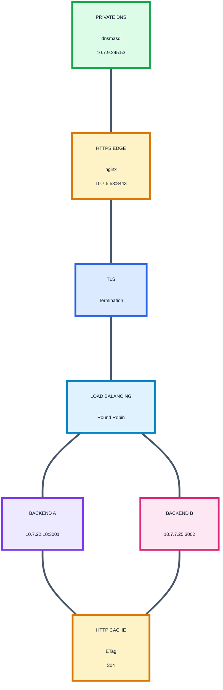

---

# End of README
